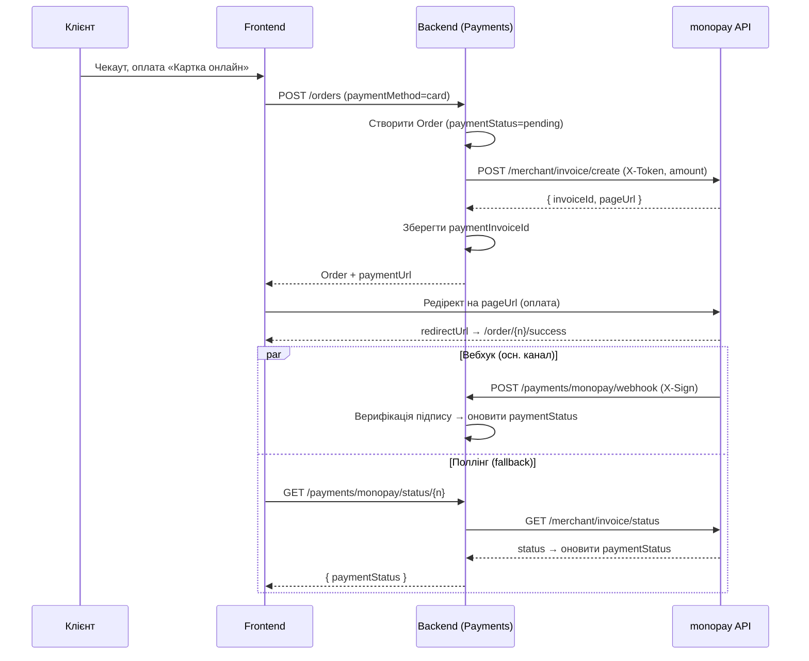

# Архітектура бекенду — tesla-backend (NestJS)

**Версія:** 1.1
**Дата:** 16.07.2026
**Статус:** Draft
**Стек:** NestJS · Prisma · PostgreSQL · S3
**Пов'язано:** [FRD](FRD.md) · [db-schema.md](db-schema.md) · [ADR-0003](adr/0003-database-postgresql.md) · [ADR-0004](adr/0004-admin-separate-app-and-roles.md) · [ADR-0005](adr/0005-implementation-order-admin-first.md)

> `tesla-backend` — **спільний backend** для двох фронтів (`tesla-frontend`, `tesla-admin`). API-first: один контракт, доступ за роллю в JWT. Реалізується **першим** після БД (ADR-0005).

---

## 1. Принципи

- **Модульність** (NestJS modules) за бізнес-доменами; чіткі межі.
- **Шаруватість:** `Controller` (HTTP/DTO) → `Service` (бізнес-логіка) → `Repository`/Prisma (дані). Жодної бізнес-логіки в контролерах.
- **API-first:** REST, глобальний префікс `/api` (без версіонування), OpenAPI (Swagger) автогенерація.
- **Валідація на межі:** DTO + `class-validator`/`class-transformer`, глобальний `ValidationPipe`.
- **RBAC:** один API, права за роллю (User/Admin/SuperAdmin) через guards.
- **Безпека за замовчуванням** (NFR-6): helmet, CORS-allowlist, rate-limit, хешування паролів, JWT+refresh.

---

## 2. Високорівнева схема

```mermaid
flowchart TB
  web["tesla-frontend (Next.js)"] -->|REST /api| api
  admin["tesla-admin (Next.js)"] -->|REST + JWT (admin)| api

  subgraph api["tesla-backend · NestJS"]
    direction TB
    G["Guards: JwtAuth · Roles · Throttler"]
    M["Модулі: auth · catalog · products · cars · categories · content-blocks · orders · payments · payment-requisites · leads · wishlist · addresses · profile · delivery-np · s3 · stats · health"]
    P["PrismaService"]
    G --> M --> P
  end

  P --> DB[("PostgreSQL")]
  M --> S3[("S3 / CDN")]
  M --> NP["Нова Пошта API"]
  M --> PAY["Платіжний шлюз"]
  M --> MAIL["Email / SMS / Telegram"]
```

---

## 3. Модулі

> Фактичний перелік — `src/modules/` у tesla-backend. Рядки без позначки — реалізовані; *(план)* — модуля ще немає.

| Модуль | Відповідальність | Доступ |
|--------|------------------|--------|
| **AuthModule** | Реєстрація/логін/refresh/logout, JWT access+refresh (httpOnly cookie), `GET /auth/me`; відновлення пароля *(план)* | public |
| **ProfileModule** | Профіль поточного користувача (`/account/profile`), зміна пароля | user |
| **AddressesModule** | Збережені адреси доставки (`/account/addresses`, CRUD + `isDefault`, [ADR-0017](adr/0017-saved-delivery-addresses.md)) | user |
| **CatalogModule** | **Публічне читання** каталогу: список з фільтрами/сортуванням/пагінацією (`include=fitment` для прайс-листа), картка за slug, пошук `/catalog/search` (pg_trgm: назва+артикул) | public |
| **ProductsModule** | **Admin CRUD** товарів: галерея AVIF, сумісність (fitment), attributes, rich-text опис | admin write |
| **CarsModule** | Довідник авто (моделі/покоління) | public read / admin write |
| **CategoriesModule** | Глобальний плоский довідник категорій | public read / admin write |
| **WishlistModule** | Обране: список користувача (CRUD, auth) + адмін-огляд попиту/контактів ([ADR-0012](adr/0012-wishlist-auth-crm.md)) | user (свої) / admin (read) |
| **OrdersModule** | Створення/перегляд/зміна статусу замовлень; `/account/orders` — історія користувача | public create / user (свої) / admin (всі) |
| **LeadsModule** | Заявки (підбір/дешевше/підписка/контакт) | public create / admin read |
| **ContentBlocksModule** | Наскрізні тексти сайту (гарантія, доставка) — фікс. набір, rich text ([ADR-0009](adr/0009-content-blocks.md)) | public read / admin write |
| **PaymentRequisitesModule** | Реквізити продавця + канали IBAN/LiqPay/monopay, шифрування секретів ([ADR-0008](adr/0008-payment-requisites-channels.md)) | **superadmin** (`/active` — public) |
| **PaymentsModule** | Онлайн-оплата monopay: створення інвойсу, вебхук (`X-Sign`), поллінг статусу ([ADR-0015](adr/0015-monopay-online-payment.md)) | public (invoice/webhook/status) |
| **DeliveryNpModule** | Нова Пошта: автопідказки міст/відділень зі свого дзеркала БД + синхронізація (cron/кнопка, [ADR-0014](adr/0014-nova-poshta-directory-mirror.md)) | public read / superadmin sync |
| **S3Module** | Завантаження → конвертація в **AVIF** (sharp), R2; presign ([ADR-0007](adr/0007-image-pipeline-avif.md)) | admin |
| **StatsModule** | Дашборд-метрики адмінки (`GET /admin/stats`) | admin/superadmin |
| **HealthModule** | Health-check (`GET /health`) | public |
| **UsersModule** *(план)* | Адмін-керування користувачами/ролями | admin/superadmin |
| **CartModule** *(план)* | Кошик (синхронізація для авторизованих; зараз кошик — клієнтський store) | user/guest |
| **BlogModule** *(план)* | Статті (модель `BlogPost` у схемі вже є) | public read / content write |
| **BannersModule** *(план)* | Банери головної (модель `Banner` у схемі вже є) | admin write |
| **SeoModule** *(план)* | Редиректи (модель `Redirect` у схемі вже є; API/middleware немає). `sitemap.xml`/`robots.txt` реалізовано на фронтенді (Next.js) | public |
| **IntegrationsModule** *(план)* | Email/SMS/Telegram-нотифікації; 1С ([ADR-0016](adr/0016-erp-1c-integration.md)). НП та еквайринг уже реалізовано окремими модулями (DeliveryNp / Payments) | internal |
| **AdminModule** *(план)* | Масовий імпорт/експорт (FR-A8, ETL-міграція — [migration-runbook.md](migration-runbook.md)); метрики вже в StatsModule | admin/superadmin |

Окремих FitmentModule / SearchModule немає: сумісність керується в ProductsModule (admin) і читається в CatalogModule; пошук — `GET /catalog/search` у CatalogModule.

---

## 4. Аутентифікація та RBAC

- **JWT:** короткий `access` (~15 хв) + `refresh` (ротація, httpOnly cookie / захищене сховище).
- **Ролі** (ADR-0004): `user` · `admin` · `superadmin`. У токені — `sub`, `role`.
- **Guards:** `JwtAuthGuard` (автентифікація) + `RolesGuard` з декоратором `@Roles('admin','superadmin')`.
- **Паролі:** `argon2` (або bcrypt).
- Адмінські ендпоінти доступні лише `admin`/`superadmin` — незалежно від того, з якого фронту запит.

```ts
@Roles('admin', 'superadmin')
@UseGuards(JwtAuthGuard, RolesGuard)
@Post('products')
create(@Body() dto: CreateProductDto) { … }
```

---

## 5. Конвенції API

- База: `/api` (глобальний префікс, без версіонування). Ресурсні маршрути (REST), узгоджені з [FRD §5](FRD.md).
- **Фільтрація каталогу:** `GET /products?car=&category=&type=&condition=&inStock=&minPrice=&maxPrice=&sort=&page=&limit=`.
- **Пагінація:** `page`/`limit` + відповідь `{ items, total, page, limit }`.
- **Помилки:** єдиний формат (`{ statusCode, message, error }`) через глобальний `ExceptionFilter`.
- **DTO + валідація:** усі вхідні дані; whitelist + forbidNonWhitelisted.
- **OpenAPI:** Swagger на `/swagger` (**вимкнено у production** — піднімається лише поза `NODE_ENV=production`).

---

## 6. Інтеграції

| Інтеграція | Призначення | Нотатки |
|------------|-------------|---------|
| **Нова Пошта API** | Міста, відділення/поштомати, ТТН/статуси | **Дзеркало довідника в БД** (`np_cities`/`np_warehouses`), автопідказки — зі своєї бази, не з АПІ на кожен запит ([ADR-0014](adr/0014-nova-poshta-directory-mirror.md)). Синхронізація: cron (`RUN_CRON`, 1/15 числа) + ручна кнопка superadmin (`POST /delivery/np/sync`). Ключ не на клієнті |
| **monopay (Monobank acquiring)** | Онлайн-оплата карткою (метод `card`) | Провайдер — **monopay** ([ADR-0015](adr/0015-monopay-online-payment.md)); токен `X-Token` — у `PaymentRequisite.monopayToken` (зашифровано, ADR-0008). Потік: інвойс (`/merchant/invoice/create`) → `pageUrl` → оплата → вебхук `X-Sign` / поллінг оновлюють `Order.paymentStatus` ([ADR-0013](adr/0013-order-status-method-columns.md)). `Order.paymentInvoiceId` привʼязує колбек. `API_PUBLIC_URL` — для `webHookUrl` (без нього лише поллінг). LiqPay можливий як другий провайдер |
| **Email / SMS / Telegram** | Підтвердження замовлень, нотифікації лідів менеджеру | Черга/ретраї; шаблони |
| **S3 / CDN** | Зберігання зображень, OG | Підписані URL для завантаження з адмінки |

Інтеграції — за **адаптер-патерном** (інтерфейс + провайдер), щоб міняти провайдера (напр. еквайринг) без зміни бізнес-логіки.

### Потік онлайн-оплати monopay ([ADR-0015](adr/0015-monopay-online-payment.md))



---

## 7. Міграція з WooCommerce (ETL)

Окремий скрипт/команда (`AdminModule`/CLI), узгоджено з [ADR-0002](adr/0002-catalog-compatibility-architecture.md):

1. **Extract:** експорт товарів/категорій/SKU з WooCommerce (MySQL/REST/CSV).
2. **Transform:**
   - наповнити `Car` (покоління/дати);
   - **дедуплікація товарів за `sku`** → один `Product`;
   - побудувати `ProductFitment` зі старих модельних категорій;
   - звести категорії до глобального довідника `Category`;
   - сформувати `Redirect` (старий URL → новий, 301).
3. **Load:** запис у PostgreSQL через Prisma; валідація; звіт розбіжностей.

---

## 8. Наскрізні аспекти

- **Конфіг:** `@nestjs/config` + zod-валідація `.env` (`env.constant.ts`) за середовищами; секрети поза репо. Окремий `PAYMENT_ENC_KEY` — для шифрування платіжних секретів.
- **Шифрування секретів:** `common/utils/crypto.util.ts` (AES-256-GCM) — для приватного ключа LiqPay у `PaymentRequisite` ([ADR-0008](adr/0008-payment-requisites-channels.md)).
- **Slug:** спільний `common/utils/slugify.ts` — транслітерація **укр/рос → латиниця** (товари/категорії/авто); slug стабільний, не змінюється при перейменуванні (SEO).
- **Кеш:** кеш гарячих читань (каталог/категорії) + ISR на фронті; інвалідація при змінах у адмінці.
- **Rate limiting:** `@nestjs/throttler` на публічних і auth-ендпоінтах (NFR-6, anti-spam форм).
- **Логування/моніторинг:** структуровані логи, request-id; помилки — у трекер.
- **Тести:** unit (services) + e2e (контролери) ключових потоків (checkout, auth, фільтри).
- **Документація API:** Swagger як частина CI.

---

## 9. Структура папок (орієнтовно)

> **Prisma 7** з `prisma.config.ts` (корінь) і драйвер-адаптером `@prisma/adapter-pg`; схема та міграції — під `src/database/prisma/`.

```
tesla-backend/
├── prisma.config.ts             # Prisma 7 config (schema/migrations/seed paths)
├── src/
│   ├── main.ts
│   ├── app.module.ts
│   ├── common/                  # constants(env,endpoints), guards, decorators, strategies, types
│   ├── database/prisma/         # PrismaService(+adapter), PrismaModule, filter, seed
│   │   ├── schemas/schema.prisma # див. db-schema.md
│   │   └── migrations/
│   ├── config/
│   └── modules/                 # фактичний перелік (див. §3)
│       ├── auth/                # controller, service, dto, strategies
│       ├── profile/             # /account/profile
│       ├── addresses/           # /account/addresses (ADR-0017)
│       ├── catalog/             # публічне читання + /catalog/search
│       ├── products/            # admin CRUD товарів
│       ├── cars/
│       ├── categories/
│       ├── content-blocks/
│       ├── wishlist/
│       ├── orders/
│       ├── leads/
│       ├── payments/            # monopay (ADR-0015)
│       ├── payment-requisites/  # superadmin (ADR-0008)
│       ├── delivery-np/         # дзеркало НП + cron-синхронізація (ADR-0014)
│       ├── s3/
│       ├── stats/               # /admin/stats
│       └── health/
└── test/                        # e2e (Testcontainers)
```

Кожен модуль: `*.module.ts`, `*.controller.ts`, `*.service.ts`, `dto/`, (за потреби) `*.repository.ts`.

---

## 10. Відкриті питання (бекенд)

1. ~~**Еквайринг:** який провайдер (LiqPay/Fondy/WayForPay/monobank) — впливає на IntegrationsModule й вебхуки.~~ → **Вирішено: monopay (Monobank acquiring)** ([ADR-0015](adr/0015-monopay-online-payment.md)); реалізовано в PaymentsModule. LiqPay — можливий другий провайдер того самого методу `card`.
2. **GraphQL чи REST-only:** наразі REST; GraphQL — за потреби фронтів.
3. **Черги:** чи вводимо черги (BullMQ/Redis) для нотифікацій/ETL одразу, чи синхронно в MVP.
4. **Кеш-шар:** Redis для кешу/сесій/rate-limit — у MVP чи пізніше.
5. **Хостинг/деплой:** середовища, CI/CD, міграції Prisma у пайплайні.
