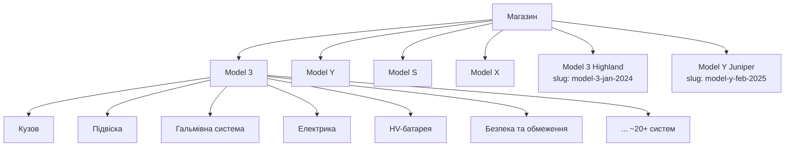

# Аудит поточного сайту — teslalviv.com (baseline)

**Документ:** Аналіз чинного сайту як точка відліку для нової версії
**Версія:** 1.0
**Дата:** 27.06.2026
**Джерело:** прямий аналіз `https://teslalviv.com` (HTML головної, `/shop`, категорії, картки товару)

> Мета документа — зафіксувати **фактичний** стан чинного сайту, щоб PRD/FRD спиралися на реальність, а ціль «зробити суттєво краще» мала вимірюване обґрунтування. Не плутати «чого немає» з «що зроблено неякісно».

---

## 1. Платформа

| Параметр | Значення (підтверджено в HTML) |
|----------|-------------------------------|
| CMS | WordPress 7.0 |
| E-commerce | WooCommerce 10.7.0 |
| SEO-плагін | All in One SEO Pro (AIOSEO) 4.9.9 |
| Форми | Contact Form 7 |
| Мова | `uk` (`<html lang="uk">`) |
| Контакт | Львів · `teslashoplviv@gmail.com` |

---

## 2. Структура каталогу

Дворівнева: **категорія (модель) → підкатегорія (система авто)**.

- **6 категорій моделей.** Slug-и Highland/Juniper нетипові: `model-3-jan-2024` та `model-y-feb-2025` — врахувати в карті 301-редиректів.
- **~20+ підкатегорій (систем) на модель**, напр. для Model 3: Кузов, Підвіска, Гальмівна система, Електрика, Акумулятор високої напруги (HV), Безпека та обмеження, Внутрішнє оздоблення, Задній привід, Передній привід, Закриваючі компоненти, Зовнішні елементи, Зовнішні ліхтарі, Зовнішні зарядні пристрої, Інфо-розважальна система, Панель приладів, Кермова система, Шасі, Сидіння, Система високої напруги, Управління температурою тощо.
- Обсяг: **1000+ SKU** (Model 3 — 438, Model Y — 263, Highland — 125, Model S — 84, Juniper — 74, Model X — 60).

---

## 3. Що ВЖЕ є на сайті (зберегти при міграції)

| Елемент | Деталі |
|---------|--------|
| Каталог категорія → підкатегорія | Працює, дерево систем у сайдбарі |
| Пошук | Базовий WooCommerce (`<form id="searchform">`, `type="search"`) |
| Сортування | Дефолтне WooCommerce (`orderby`) |
| Картка товару — галерея | ~7 фото з мініатюрами |
| Картка — SKU | «Код запчастини» (напр. `1645989-00-A`) |
| Картка — бейджі | Новий / Оригінал / Аналог |
| Картка — ціна | Стара + нова (знижка), напр. 1495 → 1150 грн |
| Картка — «Купити в 1 клік» | Реалізовано |
| Картка — «Схожі товари» | Реалізовано |
| Головна — блоки | «Обрати модель», «Популярні товари», «Блог», лід-форма |
| Лід-форма | «Залишіть заявку і ми допоможемо…» |

> **Висновок щодо scope:** сайт функціонально багатший, ніж «магазин для переробки з нуля». Проєкт — перенесення + якісне покращення.

---

## 4. Реальні слабкі місця (обґрунтування «чому новий кращий»)

| # | Проблема | Доказ | Що робимо |
|---|----------|-------|-----------|
| A1 | **Немає фільтрів** каталогу | На `/shop` і категоріях немає жодного widget'а фасетів / слайдера ціни | Повноцінні фасетні фільтри (стан, тип, наявність, ціна, система) |
| A2 | **Слабкий пошук** | Стандартний WP-пошук без автодоповнення; покриття по артикулу не гарантоване | Швидкий пошук з автодоповненням, надійно по назві та SKU |
| A3 | **Неповна головна** | Блок «Обрати модель» показує лише 4 моделі (3/Y/X/S); Highland і Juniper недоступні | Усі 6 категорій на головній |
| A4 | **Мовна неузгодженість** | Англомовні заголовки «LATEST PRODUCTS», «Latest Posts» серед UA-контенту | Узгоджена українська локалізація |
| A5 | **Продуктивність** | Типове навантаження WP + плагіни | SSR/ISR на Next.js, оптимізація зображень (S3/CDN, webp/avif) |
| A6 | **Застаріла верстка / mobile** | Старий шаблон | Mobile-first редизайн |

---

## 5. До зробити (виміряти baseline)

- [ ] Lighthouse поточного сайту (Perf / SEO / A11y / Best Practices) — точка відліку для цілі **G3 (≥ 90)**.
- [ ] LCP / TTFB головної та картки товару — відлік для **NFR-1 (LCP < 2.5с)**.
- [ ] Експорт повного дерева категорій/підкатегорій і SKU з WooCommerce — основа карти 301-редиректів (**NFR-3**) і міграції даних.
- [ ] Чи шукає поточний пошук по артикулу (перевірити вручну) — уточнити A2.
- [ ] Скриншоти ключових екранів у `assets/` для фіксації стану «до».

---

> Пов'язані документи: [PRD](PRD.md) · [FRD](FRD.md). Розбіжності, виявлені під час аудиту, внесені в обидва.
