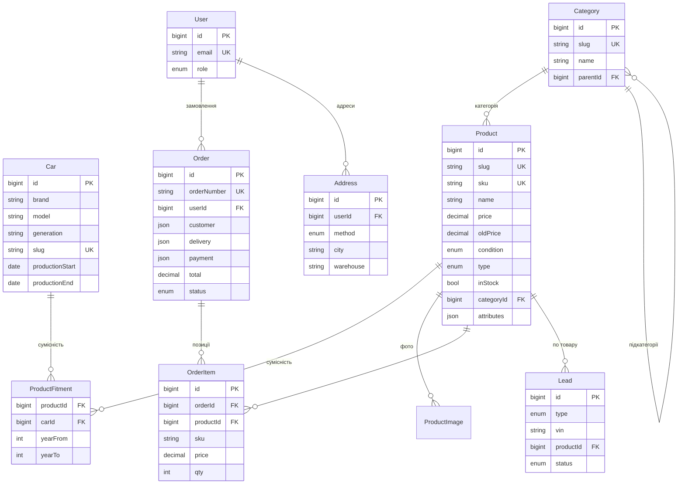

# Модель бази даних — Tesla Lviv (PostgreSQL + Prisma)

**Версія:** 1.1
**Дата:** 27.06.2026
**Статус:** Draft
**Пов'язано:** [FRD §6](FRD.md) · [ADR-0002](adr/0002-catalog-compatibility-architecture.md) (каталог/сумісність) · [ADR-0003](adr/0003-database-postgresql.md) (PostgreSQL)

> Реляційна схема під архітектуру ADR-0002: **сумісність відокремлена від таксономії** (довідник авто `Car` + M2M `ProductFitment`), категорії — глобальний довідник, товар — один canonical-запис. ORM — **Prisma** (схема нижче в нотації Prisma). JSONB (`Json`) — для гнучких полів.

---

## 1. ER-діаграма



---

## 2. Prisma-схема (`schema.prisma`)

```prisma
generator client {
  provider = "prisma-client-js"
}

datasource db {
  provider = "postgresql"
  url      = env("DATABASE_URL")
}

// ───────── Enums ─────────
enum ProductType      { original analog }
enum ProductCondition { new used clearance }      // Новий / Б/у / Уцінка
enum OrderStatus      { new processing shipped done canceled }
enum DeliveryMethod   { np ukrposhta pickup }
enum PaymentMethod    { card cod iban cash }
enum PaymentStatus    { pending paid failed refunded }
enum UserRole         { user admin superadmin }
enum LeadType         { fitment price_match price_subscribe contact }
enum LeadStatus       { new handled }

// ───────── Каталог ─────────
model Car {
  id              BigInt    @id @default(autoincrement())
  brand           String    @default("Tesla")
  model           String                                  // Model 3 / Model Y / Model S / Model X
  generation      String?                                 // Pre-facelift / Highland / Phase 1 / Juniper
  slug            String    @unique                       // model-3-highland
  productionStart DateTime? @map("production_start") @db.Date
  productionEnd   DateTime? @map("production_end")   @db.Date  // null = у виробництві
  fitment         ProductFitment[]
  @@map("cars")
}

model Category {
  id        BigInt     @id @default(autoincrement())
  slug      String     @unique                              // kuzov
  name      String                                          // Кузов
  parentId  BigInt?    @map("parent_id")
  parent    Category?  @relation("CategoryTree", fields: [parentId], references: [id])
  children  Category[] @relation("CategoryTree")
  sortOrder Int        @default(0) @map("sort_order")
  seo       Json       @default("{}")
  products  Product[]
  @@map("categories")
}

model Product {
  id            BigInt           @id @default(autoincrement())
  slug          String           @unique
  sku           String           @unique                   // артикул / код запчастини
  name          String
  price         Decimal          @db.Decimal(12, 2)
  oldPrice      Decimal?         @map("old_price") @db.Decimal(12, 2)
  condition     ProductCondition @default(new)             // new | used | clearance
  type          ProductType                                // original | analog
  inStock       Boolean          @default(true) @map("in_stock")
  stockQty      Int              @default(0)   @map("stock_qty")
  categoryId    BigInt           @map("category_id")
  category      Category         @relation(fields: [categoryId], references: [id])
  attributes    Json             @default("{}")            // гнучкі характеристики
  description   String?
  warranty      String?
  deliveryTerms String?          @map("delivery_terms")
  seo           Json             @default("{}")            // { title, description, ogImage }
  isActive      Boolean          @default(true) @map("is_active")
  createdAt     DateTime         @default(now()) @map("created_at")
  updatedAt     DateTime         @updatedAt      @map("updated_at")

  fitment    ProductFitment[]
  images     ProductImage[]
  related    ProductRelated[] @relation("ProductRelated")
  relatedBy  ProductRelated[] @relation("RelatedProduct")
  orderItems OrderItem[]
  leads      Lead[]

  @@index([categoryId])
  @@index([isActive, inStock])
  @@index([price])
  @@map("products")
}

// M2M сумісність товар ↔ авто
model ProductFitment {
  productId BigInt  @map("product_id")
  carId     BigInt  @map("car_id")
  yearFrom  Int?    @map("year_from")                      // уточнення в межах покоління (опц.)
  yearTo    Int?    @map("year_to")
  product   Product @relation(fields: [productId], references: [id], onDelete: Cascade)
  car       Car     @relation(fields: [carId],     references: [id], onDelete: Cascade)
  @@id([productId, carId])
  @@index([carId])
  @@map("product_fitment")
}

model ProductImage {
  id        BigInt  @id @default(autoincrement())
  productId BigInt  @map("product_id")
  product   Product @relation(fields: [productId], references: [id], onDelete: Cascade)
  url       String                                         // S3 URL
  alt       String?
  sortOrder Int     @default(0) @map("sort_order")
  @@map("product_images")
}

model ProductRelated {
  productId BigInt  @map("product_id")
  relatedId BigInt  @map("related_id")
  product   Product @relation("ProductRelated", fields: [productId], references: [id], onDelete: Cascade)
  related   Product @relation("RelatedProduct", fields: [relatedId], references: [id], onDelete: Cascade)
  @@id([productId, relatedId])
  @@map("product_related")
}

// ───────── Користувачі та замовлення ─────────
model User {
  id           BigInt    @id @default(autoincrement())
  email        String?   @unique
  phone        String?
  passwordHash String?   @map("password_hash")
  firstName    String?   @map("first_name")
  lastName     String?   @map("last_name")
  role         UserRole  @default(user)                    // user | admin | superadmin
  createdAt    DateTime  @default(now()) @map("created_at")
  addresses    Address[]
  orders       Order[]
  leads        Lead[]
  @@map("users")
}

model Address {
  id        BigInt         @id @default(autoincrement())
  userId    BigInt         @map("user_id")
  user      User           @relation(fields: [userId], references: [id], onDelete: Cascade)
  label     String?
  method    DeliveryMethod
  city      String?
  warehouse String?
  recipient String?
  phone     String?
  isDefault Boolean        @default(false) @map("is_default")
  @@map("addresses")
}

model Order {
  id          BigInt      @id @default(autoincrement())
  orderNumber String      @unique @map("order_number")
  userId      BigInt?     @map("user_id")                  // null = гість
  user        User?       @relation(fields: [userId], references: [id], onDelete: SetNull)
  customer    Json                                         // { name, phone, email }
  delivery    Json                                         // { method, city, warehouse }
  payment     Json                                         // { method, status }
  total       Decimal     @db.Decimal(12, 2)
  status      OrderStatus @default(new)
  isOneClick  Boolean     @default(false) @map("is_one_click")
  comment     String?
  createdAt   DateTime    @default(now()) @map("created_at")
  items       OrderItem[]
  @@index([userId])
  @@index([status])
  @@map("orders")
}

model OrderItem {
  id        BigInt   @id @default(autoincrement())
  orderId   BigInt   @map("order_id")
  order     Order    @relation(fields: [orderId], references: [id], onDelete: Cascade)
  productId BigInt?  @map("product_id")
  product   Product? @relation(fields: [productId], references: [id], onDelete: SetNull)
  name      String                                         // снапшот на момент покупки
  sku       String
  price     Decimal  @db.Decimal(12, 2)
  qty       Int
  @@map("order_items")
}

// ───────── Ліди та контент ─────────
model Lead {
  id          BigInt     @id @default(autoincrement())
  type        LeadType
  name        String
  phone       String
  email       String?
  vin         String?                                       // type = fitment
  link        String?                                       // type = price_match
  targetPrice Decimal?   @map("target_price") @db.Decimal(12, 2)  // type = price_subscribe
  productId   BigInt?    @map("product_id")
  product     Product?   @relation(fields: [productId], references: [id], onDelete: SetNull)
  userId      BigInt?    @map("user_id")                           // якщо лід від авторизованого
  user        User?      @relation(fields: [userId], references: [id], onDelete: SetNull)
  message     String?
  status      LeadStatus @default(new)
  createdAt   DateTime   @default(now()) @map("created_at")
  @@index([status, type])
  @@map("leads")
}

model BlogPost {
  id          BigInt    @id @default(autoincrement())
  slug        String    @unique
  title       String
  excerpt     String?
  content     String?                                       // HTML / MDX
  coverImage  String?   @map("cover_image")
  author      String?
  category    String?
  status      String    @default("draft")                   // draft | published
  publishedAt DateTime? @map("published_at")
  seo         Json      @default("{}")
  @@map("blog_posts")
}

model Banner {
  id        BigInt  @id @default(autoincrement())
  image     String
  link      String?
  title     String?
  sortOrder Int     @default(0) @map("sort_order")
  isActive  Boolean @default(true) @map("is_active")
  @@map("banners")
}

// Карта 301-редиректів зі старого сайту (NFR-3, ADR-0001)
model Redirect {
  id       BigInt @id @default(autoincrement())
  fromPath String @unique @map("from_path")
  toPath   String @map("to_path")
  status   Int    @default(301)
  @@map("redirects")
}
```

---

## 3. Індекси та пошук

- Базові індекси задано в схемі через `@@index` / `@unique` (category, price, isActive+inStock, fitment.carId, orders.status/userId, leads.status+type).
- **Пошук за назвою та артикулом** (FR-4.1) — трграмні GIN-індекси `pg_trgm`. Prisma не виражає `gin_trgm_ops` у схемі, тому додаємо **raw-міграцією**:

```sql
-- prisma/migrations/<ts>_trgm/migration.sql
CREATE EXTENSION IF NOT EXISTS pg_trgm;
CREATE INDEX idx_products_name_trgm ON products USING gin (name gin_trgm_ops);
CREATE INDEX idx_products_sku_trgm  ON products USING gin (sku  gin_trgm_ops);
-- за потреби: GIN на attributes (jsonb)
CREATE INDEX idx_products_attrs ON products USING gin (attributes);
```

---

## 4. Типові запити (Prisma Client)

```ts
// Товари для авто X у категорії Y (каталог /category/[model]/[category])
const products = await prisma.product.findMany({
  where: { isActive: true, categoryId, fitment: { some: { carId } } },
  orderBy: { createdAt: 'desc' },
  take: 24,
})

// Сумісність товару (картка: «Підходить до …»)
const fitment = await prisma.productFitment.findMany({
  where: { productId },
  include: { car: true },
})

// Пошук за назвою/артикулом (автодоповнення) — через trgm
const found = await prisma.$queryRaw`
  SELECT * FROM products
  WHERE is_active AND (name ILIKE ${q + '%'} OR sku ILIKE ${q + '%'})
  ORDER BY similarity(name, ${q}) DESC LIMIT 8`
```

---

## 5. Нотатки

- **Снапшот у замовленні:** `OrderItem` зберігає `name/sku/price` на момент покупки; `productId` лише для зв'язку (`onDelete: SetNull`).
- **Гостьовий кошик** — у `localStorage`; кошик авторизованого можна синхронізувати окремими моделями `Cart/CartItem` (за потреби; у MVP — клієнтський + відновлення).
- **Сумісність із роками:** `yearFrom/yearTo` уточнюють у межах покоління; зазвичай достатньо `carId` (покоління вже має дати).
- **VIN-підбір (Фаза 3):** VIN → `Car` → `ProductFitment` → товари.
- **Міграція (ADR-0002):** дедуплікація товарів за `sku`, побудова `ProductFitment` зі старих модельних категорій, наповнення `Car`, `Redirect`.
- **`price_subscribe`** (FR-3.10) реалізується через `Lead` (type=`price_subscribe`); за потреби — окрема модель із нотифікаціями.
- **BigInt id:** за бажанням можна замінити на `Int` для простоти (якщо обсяги не вимагають 64-біт).
