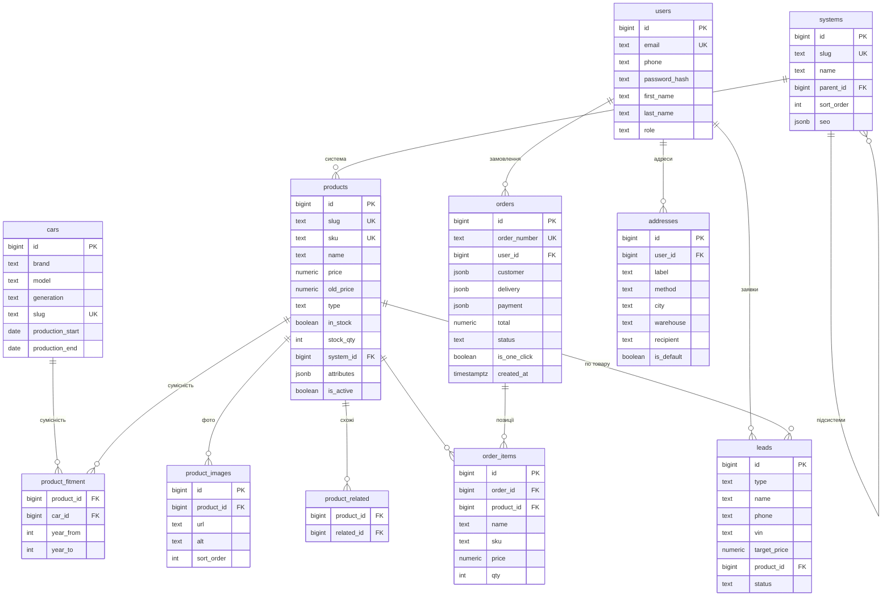

# Модель бази даних — Tesla Lviv (PostgreSQL)

**Версія:** 1.0
**Дата:** 27.06.2026
**Статус:** Draft
**Пов'язано:** [FRD §6](FRD.md) · [ADR-0002](adr/0002-catalog-compatibility-architecture.md) (каталог/сумісність) · [ADR-0003](adr/0003-database-postgresql.md) (PostgreSQL)

> Реляційна схема під архітектуру з ADR-0002: **сумісність відокремлена від таксономії** (довідник авто `cars` + M2M `product_fitment`), системи — глобальний довідник, товар — один canonical-запис. JSONB — для гнучких полів (характеристики, SEO, адреси/оплата в замовленні).

---

## 1. ER-діаграма



> Контент-сутності (`blog_posts`, `banners`, `redirects`) самостійні й на діаграмі опущені для чистоти — деталі в §3.

---

## 2. Enum-типи

```sql
CREATE TYPE product_type     AS ENUM ('original','analog');
CREATE TYPE product_condition AS ENUM ('new');                 -- зараз лише new; розширюване
CREATE TYPE order_status     AS ENUM ('new','processing','shipped','done','canceled');
CREATE TYPE delivery_method  AS ENUM ('np','ukrposhta','pickup');
CREATE TYPE payment_method   AS ENUM ('card','cod','iban','cash');
CREATE TYPE payment_status   AS ENUM ('pending','paid','failed','refunded');
CREATE TYPE user_role        AS ENUM ('user','admin','superadmin');  -- user=покупець
CREATE TYPE lead_type        AS ENUM ('fitment','price_match','price_subscribe','contact');
CREATE TYPE lead_status      AS ENUM ('new','handled');
```

---

## 3. Таблиці

### 3.1 Каталог

```sql
-- Довідник авто (рівень покоління/фейсліфта)
CREATE TABLE cars (
  id               bigserial PRIMARY KEY,
  brand            text NOT NULL DEFAULT 'Tesla',
  model            text NOT NULL,                 -- Model 3 / Model Y / Model S / Model X
  generation       text,                          -- Pre-facelift / Highland / Phase 1 / Juniper
  slug             text NOT NULL UNIQUE,          -- model-3-highland
  production_start date,
  production_end   date                           -- NULL = у виробництві
);

-- Глобальний довідник систем авто
CREATE TABLE systems (
  id          bigserial PRIMARY KEY,
  slug        text NOT NULL UNIQUE,               -- kuzov
  name        text NOT NULL,                      -- Кузов
  parent_id   bigint REFERENCES systems(id) ON DELETE SET NULL,
  sort_order  int NOT NULL DEFAULT 0,
  seo         jsonb NOT NULL DEFAULT '{}'
);

-- Товар (один canonical-запис)
CREATE TABLE products (
  id             bigserial PRIMARY KEY,
  slug           text NOT NULL UNIQUE,
  sku            text NOT NULL UNIQUE,            -- артикул / код запчастини
  name           text NOT NULL,
  price          numeric(12,2) NOT NULL,
  old_price      numeric(12,2),                   -- NULL якщо без знижки
  condition      product_condition NOT NULL DEFAULT 'new',
  type           product_type NOT NULL,           -- original | analog
  in_stock       boolean NOT NULL DEFAULT true,
  stock_qty      int NOT NULL DEFAULT 0,
  system_id      bigint NOT NULL REFERENCES systems(id),
  attributes     jsonb NOT NULL DEFAULT '{}',     -- гнучкі характеристики
  description    text,
  warranty       text,
  delivery_terms text,
  seo            jsonb NOT NULL DEFAULT '{}',      -- { title, description, ogImage }
  is_active      boolean NOT NULL DEFAULT true,
  created_at     timestamptz NOT NULL DEFAULT now(),
  updated_at     timestamptz NOT NULL DEFAULT now()
);

-- M2M сумісність товар ↔ авто
CREATE TABLE product_fitment (
  product_id bigint NOT NULL REFERENCES products(id) ON DELETE CASCADE,
  car_id     bigint NOT NULL REFERENCES cars(id) ON DELETE CASCADE,
  year_from  int,                                 -- уточнення в межах покоління (опц.)
  year_to    int,
  PRIMARY KEY (product_id, car_id)
);

CREATE TABLE product_images (
  id         bigserial PRIMARY KEY,
  product_id bigint NOT NULL REFERENCES products(id) ON DELETE CASCADE,
  url        text NOT NULL,                        -- S3 URL
  alt        text,
  sort_order int NOT NULL DEFAULT 0
);

CREATE TABLE product_related (
  product_id bigint NOT NULL REFERENCES products(id) ON DELETE CASCADE,
  related_id bigint NOT NULL REFERENCES products(id) ON DELETE CASCADE,
  PRIMARY KEY (product_id, related_id)
);
```

### 3.2 Користувачі та замовлення

```sql
CREATE TABLE users (
  id            bigserial PRIMARY KEY,
  email         text UNIQUE,
  phone         text,
  password_hash text,
  first_name    text,
  last_name     text,
  role          user_role NOT NULL DEFAULT 'user',
  created_at    timestamptz NOT NULL DEFAULT now()
);

CREATE TABLE addresses (
  id         bigserial PRIMARY KEY,
  user_id    bigint NOT NULL REFERENCES users(id) ON DELETE CASCADE,
  label      text,
  method     delivery_method NOT NULL,
  city       text,
  warehouse  text,
  recipient  text,
  phone      text,
  is_default boolean NOT NULL DEFAULT false
);

CREATE TABLE orders (
  id           bigserial PRIMARY KEY,
  order_number text NOT NULL UNIQUE,              -- людино-читабельний №
  user_id      bigint REFERENCES users(id) ON DELETE SET NULL,  -- NULL = гість
  customer     jsonb NOT NULL,                    -- { name, phone, email }
  delivery     jsonb NOT NULL,                    -- { method, city, warehouse }
  payment      jsonb NOT NULL,                    -- { method, status }
  total        numeric(12,2) NOT NULL,
  status       order_status NOT NULL DEFAULT 'new',
  is_one_click boolean NOT NULL DEFAULT false,
  comment      text,
  created_at   timestamptz NOT NULL DEFAULT now()
);

CREATE TABLE order_items (
  id         bigserial PRIMARY KEY,
  order_id   bigint NOT NULL REFERENCES orders(id) ON DELETE CASCADE,
  product_id bigint REFERENCES products(id) ON DELETE SET NULL,  -- зберігаємо name/sku як снапшот
  name       text NOT NULL,
  sku        text NOT NULL,
  price      numeric(12,2) NOT NULL,             -- ціна на момент замовлення
  qty        int NOT NULL
);
```

### 3.3 Ліди та контент

```sql
CREATE TABLE leads (
  id           bigserial PRIMARY KEY,
  type         lead_type NOT NULL,
  name         text NOT NULL,
  phone        text NOT NULL,
  email        text,
  vin          text,                              -- для type='fitment'
  link         text,                              -- для type='price_match'
  target_price numeric(12,2),                     -- для type='price_subscribe'
  product_id   bigint REFERENCES products(id) ON DELETE SET NULL,
  message      text,
  status       lead_status NOT NULL DEFAULT 'new',
  created_at   timestamptz NOT NULL DEFAULT now()
);

CREATE TABLE blog_posts (
  id           bigserial PRIMARY KEY,
  slug         text NOT NULL UNIQUE,
  title        text NOT NULL,
  excerpt      text,
  content      text,                              -- HTML / MDX
  cover_image  text,
  author       text,
  category     text,
  status       text NOT NULL DEFAULT 'draft',     -- draft | published
  published_at timestamptz,
  seo          jsonb NOT NULL DEFAULT '{}'
);

-- Банери головної (FR-A7)
CREATE TABLE banners (
  id         bigserial PRIMARY KEY,
  image      text NOT NULL,
  link       text,
  title      text,
  sort_order int NOT NULL DEFAULT 0,
  is_active  boolean NOT NULL DEFAULT true
);

-- Карта 301-редиректів зі старого сайту (NFR-3, ADR-0001)
CREATE TABLE redirects (
  id        bigserial PRIMARY KEY,
  from_path text NOT NULL UNIQUE,
  to_path   text NOT NULL,
  status    int NOT NULL DEFAULT 301
);
```

---

## 4. Індекси

```sql
-- Каталог і фільтрація
CREATE INDEX idx_products_system   ON products(system_id);
CREATE INDEX idx_products_active   ON products(is_active, in_stock);
CREATE INDEX idx_products_price    ON products(price);
CREATE INDEX idx_products_attrs    ON products USING gin(attributes);
CREATE INDEX idx_fitment_car       ON product_fitment(car_id);          -- «товари для авто X»

-- Пошук за назвою та артикулом (FR-4.1) — pg_trgm
CREATE EXTENSION IF NOT EXISTS pg_trgm;
CREATE INDEX idx_products_name_trgm ON products USING gin(name gin_trgm_ops);
CREATE INDEX idx_products_sku_trgm  ON products USING gin(sku  gin_trgm_ops);

-- Замовлення
CREATE INDEX idx_orders_user   ON orders(user_id);
CREATE INDEX idx_orders_status ON orders(status);
CREATE INDEX idx_orders_number ON orders(order_number);

-- Ліди
CREATE INDEX idx_leads_status  ON leads(status, type);
```

---

## 5. Типові запити

```sql
-- Товари для авто X у системі Y (каталог /category/[model]/[system])
SELECT p.* FROM products p
JOIN product_fitment f ON f.product_id = p.id
WHERE f.car_id = :car_id AND p.system_id = :system_id
  AND p.is_active ORDER BY p.created_at DESC LIMIT 24;

-- Сумісність товару (для картки: «Підходить до …»)
SELECT c.model, c.generation FROM cars c
JOIN product_fitment f ON f.car_id = c.id
WHERE f.product_id = :product_id;

-- Пошук за назвою/артикулом з автодоповненням
SELECT * FROM products
WHERE is_active AND (name ILIKE :q || '%' OR sku ILIKE :q || '%')
ORDER BY similarity(name, :q) DESC LIMIT 8;
```

---

## 6. Нотатки

- **Снапшот у замовленні:** `order_items` зберігає `name/sku/price` на момент покупки (товар може змінитись/зникнути) — `product_id` лише для зв'язку.
- **Гостьовий кошик** — у `localStorage` на клієнті; кошик авторизованого можна синхронізувати таблицею `carts/cart_items` (за потреби; у MVP — теж клієнтський + відновлення).
- **Сумісність із роками:** `year_from/year_to` уточнюють у межах покоління; зазвичай достатньо `car_id` (покоління вже має дати).
- **VIN-підбір (Фаза 3):** VIN → визначення `cars` → `product_fitment` → товари.
- **Міграція (ADR-0002):** дедуплікація товарів за `sku`, побудова `product_fitment` зі старих модельних категорій, наповнення `cars`, `redirects`.
- **`price_subscribe`** (FR-3.10) реалізується через `leads` (type='price_subscribe'); за потреби винести в окрему таблицю з нотифікаціями.
