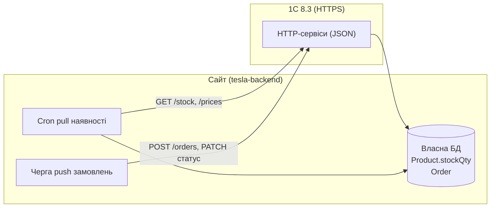

# ТЗ: Інтеграція сайту з 1С

> Архітектурне рішення — [ADR-0016](adr/0016-erp-1c-integration.md).
> Каталог/контент лишається на сайті (ADR-0002). З 1С — наявність (+опц. ціни/знижки). У 1С — замовлення.

## 1. Принцип

- **Сайт — ініціатор («дьоргає» 1С).** 1С виступає **HTTP-сервером**, сайт — **клієнтом**.
- **1С налаштовується один раз.** Контракт site-agnostic; кожен новий сайт підключається без доробок на боці 1С — лише свої креденшли й конфіг.
- **Кожен сайт має власну БД і каталог.** З 1С синхронізуємо наявність, у 1С відправляємо замовлення й статуси.



## 2. Межі та джерела правди

| Дані | Джерело | Напрямок | Механізм |
|---|---|---|---|
| Номенклатура, назви, характеристики, SEO, зображення, сумісність авто | **Сайт** | — | admin |
| Наявність (`stockQty`) | **1С** | 1С → сайт | pull (cron), кеш у БД |
| Базова ціна | **1С** | 1С → сайт | pull (cron), кеш у БД |
| Знижка / акційна ціна | **Сайт** | — | рахується на сайті (promo-логіка в admin) |
| Замовлення | **Сайт** | сайт → 1С | push одразу після створення |
| Статус замовлення / оплати | **Сайт** | сайт → 1С | push при зміні |

**Ключ матчингу** товар ↔ номенклатура 1С — **`sku` (артикул)**. Fallback — 1С-GUID (за потреби зберігаємо на товарі).

## 3. Контракт HTTP-сервісів 1С (завдання для 1С-програміста)

Загальне для всіх ендпоінтів:
- Транспорт: **HTTPS**, тіла — **JSON** (UTF-8).
- Автентифікація: сервіс-акаунт 1С — **Basic Auth** або **Bearer-токен** (узгодити). Доступ обмежити **IP-allowlist**.
- Версіонування: префікс шляху, напр. `/hs/site/v1/...` (`site` — імʼя публікації HTTP-сервісу).
- Пагінація/інкрементальність: `changedSince` (ISO-8601, UTC) + `page`/`pageSize`; відповідь містить ознаку наявності наступної сторінки.
- Помилки: коректні HTTP-коди (400/401/404/409/422/500) + тіло `{ "error": { "code", "message" } }`.

### 3.1 `GET /stock` — наявність

Параметри: `changedSince` (опц., лише змінені після дати), `sku` (опц., один/кілька), `page`, `pageSize`.

```json
{
  "items": [
    { "sku": "1044534-00-A", "stockQty": 7,  "updatedAt": "2026-07-06T08:30:00Z" },
    { "sku": "1096894-00-B", "stockQty": 0,  "updatedAt": "2026-07-06T08:31:00Z" }
  ],
  "page": 1, "pageSize": 500, "hasMore": true
}
```

- `stockQty` — ціле, доступний до продажу залишок (з урахуванням резервів на боці 1С, якщо так вирішимо). Сайт трактує `stockQty > 0` як «в наявності».
- Якщо складів кілька — 1С **сумує** у єдиний `stockQty` (розбивку по складах сайту не треба, деталь узгоджується).

### 3.2 `GET /prices` — базова ціна

Параметри: `changedSince`, `sku`, `page`, `pageSize`. **Тип ціни** для сайту фіксується на боці 1С (або передається параметром `priceType` — узгодити).

1С віддає **лише базову ціну**. Знижку/акційну ціну **рахує сайт** (promo-логіка в admin) — поля `discount` у контракті немає.

```json
{
  "items": [
    { "sku": "1044534-00-A", "price": 4200.00, "currency": "UAH" },
    { "sku": "1096894-00-B", "price": 1850.00, "currency": "UAH" }
  ],
  "page": 1, "pageSize": 500, "hasMore": false
}
```

> Деталі ціноутворення (тип ціни, валюта) остаточно визначає 1С-програміст. Акції/знижки — поза контрактом 1С.

### 3.3 `POST /orders` — приймання замовлення

**Ідемпотентно за `externalId`** (наш `Order.id`/номер): повторний `POST` з тим самим `externalId` **не створює дубль**, а повертає вже створене замовлення.

```json
{
  "externalId": "TSL-2026-000123",
  "createdAt": "2026-07-06T09:00:00Z",
  "customer":  { "name": "Іван Петренко", "phone": "+380671234567", "email": "ivan@example.com" },
  "delivery":  {
    "method": "nova_poshta",
    "cityRef": "8d5a980d-...", "warehouseRef": "1ec09d2e-...",
    "cityName": "Львів", "warehouse": "Відділення №5"
  },
  "payment":   { "method": "card", "status": "paid" },
  "items": [
    { "sku": "1044534-00-A", "qty": 1, "price": 4200.00 },
    { "sku": "1096894-00-B", "qty": 2, "price": 1750.00 }
  ],
  "total": 7700.00,
  "currency": "UAH",
  "comment": ""
}
```

Відповідь:

```json
{ "externalId": "TSL-2026-000123", "orderId1c": "0000-000456", "status": "accepted" }
```

- `items[].price` — **фактична ціна продажу** (базова ціна з 1С мінус знижка сайту), снапшот `OrderItem`.
- Якщо `sku` немає в 1С — 1С вирішує: створити позицію на льоту / відхилити з `422` і переліком проблемних `sku` (узгодити). Рекомендація: **не падати цілим замовленням**, повертати попередження.
- `payment.method` — з нашого enum (`cash`/`card`/`iban`/`cod` тощо, ADR-0013/0015); `delivery.method` — `nova_poshta`/`pickup` (ADR-0014).

### 3.4 `PATCH /orders/{externalId}` — оновлення статусу/оплати

Сайт — **єдиний writer** статусу й оплати. 1С — дзеркало: зміни оператора в 1С **назад не синхронізуються** (ADR-0016), PATCH завжди перезаписує. Тіло часткове — шлемо лише те, що змінилось.

**Захист від гонок і ретраїв — `revision`:** монотонна версія замовлення на боці сайту (інкрементиться при кожній зміні статусу/оплати). 1С зберігає останній застосований `revision` і **застосовує зміну лише якщо новий `revision` більший** за збережений. Це робить PATCH ідемпотентним і стійким до **out-of-order** доставки (пізній retry зі старим станом не перекриє новіший — напр. не поверне `paid → pending`).

Тіло:

```json
{
  "revision": 5,
  "changedAt": "2026-07-07T10:15:00Z",
  "status": "shipped",
  "payment": { "status": "paid", "method": "card", "paidAt": "2026-07-07T10:14:30Z" }
}
```

Відповідь — echo застосованого стану + ознака, чи зміну прийнято:

```json
{
  "externalId": "TSL-2026-000123",
  "orderId1c": "0000-000456",
  "status": "shipped",
  "payment": { "status": "paid" },
  "revision": 5,
  "applied": true
}
```

- **`200` + `applied: true`** — зміну застосовано.
- **`200` + `applied: false`** — прийшов **застарілий** `revision` (менший/рівний збереженому): 1С нічого не змінює, повертає поточний стан. Сайт **не ретраїть** (це нормальний результат гонки).
- **`404`** — замовлення ще не створене в 1С (POST у черзі/не пройшов). Сайт **не губить** зміну: лишає її в черзі й досилає після підтвердженого `POST /orders` (див. §4 — ordering). За рахунок ordering це рідкісний край, а не норма.
- `status` / `payment.status` — з узгодженого enum, включно з `cancelled` / `refunded`.

> Мапінг наших статусів `Order.status`/`paymentStatus` ↔ статуси документа 1С узгодити окремою таблицею з 1С-програмістом.

**Альтернатива (за вибором 1С-програміста):** замість окремих `POST` + `PATCH` — єдиний ідемпотентний `PUT /orders/{externalId}`, що завжди надсилає повний авторитетний снапшот замовлення (позиції + статус + оплата) з `revision`; 1С робить upsert. Плюс — один шлях, самозцілення (пропущене оновлення виправить наступний sync), відсутність проблеми ordering. Мінус — не всі конфігурації 1С дозволяють міняти вже проведений документ. Рекомендація: залишити `POST` + `PATCH`, якщо документ у 1С може бути проведеним/закритим.

## 4. Реалізація на боці сайту (tesla-backend)

- Новий модуль **`erp`** з інтерфейсом **`ErpProvider`** (1С — перша реалізація `OneCProvider`), щоб джерело ERP можна було замінити.
- **Pull наявності й ціни:** cron (напр. кожні 5–15 хв), інкрементально за `changedSince` (зберігаємо `lastSyncAt`); мапимо `sku → Product.stockQty` + базову ціну. **Знижку/акційну ціну рахує сайт** (promo-логіка в admin) поверх базової. Товарів без матчу за `sku` — лог, не помилка.
- **Push замовлень:** при створенні `Order` ставимо задачу в **чергу**; воркер шле `POST /orders` з **ідемпотентним `externalId`**, ретраї з backoff.
- **Push статусу/оплати:** при зміні `Order.status`/`paymentStatus` інкрементимо `Order.erpRevision` і шлемо `PATCH` із цим `revision`.
  - **Ordering:** PATCH відправляється **лише після** підтвердженого `POST /orders` (отримано `orderId1c`). Поки замовлення не створене в 1С — зміни чекають у черзі; після створення досилається **останній** стан (проміжні можна злити).
  - **Стійкість до гонок:** `revision` на боці 1С відсікає застарілі/переставлені ретраї; сайт не ретраїть відповідь `applied: false`.
- **Стійкість:** 1С недоступний → наявність із кешу (`stockQty`), замовлення чекають у черзі. Опційно — фінальна перевірка залишку (`GET /stock?sku=`) при оформленні/оплаті.
- **Логування:** таблиця логів обмінів (запит/відповідь/помилка/тривалість) для діагностики.
- **Конфіг per-site** (env або БД): базовий URL 1С, креденшли, розклад cron, чи тягнути ціни, `priceType`, поріг/увімкнення інтеграції.

Приклад env:

```
ERP_1C_ENABLED=true
ERP_1C_BASE_URL=https://1c.example.com/hs/site/v1
ERP_1C_AUTH=basic            # basic | bearer
ERP_1C_USER=site_svc
ERP_1C_PASSWORD=***
ERP_1C_SYNC_STOCK_CRON=*/10 * * * *
ERP_1C_SYNC_PRICES=true
ERP_1C_PRICE_TYPE=Роздрібна
```

## 5. Безпека

- Тільки **HTTPS**; окремий **сервіс-акаунт** 1С з доступом лише до потрібних HTTP-сервісів.
- **IP-allowlist** на боці 1С/веб-сервера (адреси наших бекендів).
- Креденшли — у секретах середовища, не в коді; не логувати тіла з чутливими даними у відкритому вигляді.

## 6. Відкриті питання (узгодити з 1С-програмістом)

1. Auth: Basic чи Bearer-токен; формат і ротація.
2. Ціни: який тип ціни віддає 1С, валюта (знижка/акція рахується на сайті — з 1С лише базова ціна).
3. Поведінка `POST /orders` при невідомому `sku` (створювати / відхиляти / попереджати).
4. Мапінг статусів `Order.status`/`paymentStatus` ↔ статуси документа 1С.
5. Резерв товару при замовленні (чи 1С резервує, як це впливає на `stockQty`).
6. Розбивка по складах (потрібна сумарна наявність чи по складах).
