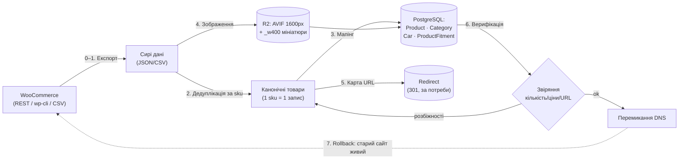

# Runbook міграції даних — WooCommerce → новий стек (ETL)

**Версія:** 1.0
**Дата:** 16.07.2026
**Статус:** Draft
**Пов'язано:** [PRD §1](PRD.md) · [FRD FR-A8, NFR-3](FRD.md) · [db-schema.md §5](db-schema.md) · [ADR-0001](adr/0001-url-structure-and-redirects.md) (URL/редіректи) · [ADR-0002](adr/0002-catalog-compatibility-architecture.md) (канонічний товар, M2M-сумісність) · [ADR-0007](adr/0007-image-pipeline-avif.md) (AVIF-пайплайн) · [SEO-стратегія §2.1](seo-strategy.md)

> Покроковий план перенесення каталогу з чинного `teslalviv.com` (WordPress 7.0 + WooCommerce 10.7.0, **1000+ SKU**: Model 3 — 438, Model Y — 263, Model 3 Highland — 125, Model S — 84, Model Y Juniper — 74, Model X — 60) у нову БД (PostgreSQL + Prisma). Без цієї міграції запуск неможливий — runbook консолідує згадки, розкидані по PRD, ADR-0002, db-schema §5 і FR-A8.

## Загальна схема

## 0. Передумови та доступи

Перед стартом мають бути на руках:

- **WP-адмінка** `teslalviv.com` (роль administrator) — для CSV-експорту та створення REST-ключів.
- **WooCommerce REST-ключі** (Consumer key/secret, read-only): WP-адмінка → WooCommerce → Settings → Advanced → REST API.
- **SSH до хостингу старого сайту** (опційно, для `wp-cli` та прямого доступу до `wp-content/uploads/`).
- **R2-креденшли** нового стеку (ті самі, що в `tesla-backend/.env`) або admin-токен бекенда для аплоаду через `POST /api/s3/upload`.
- **Dev/staging-екземпляр** нового стеку з застосованими Prisma-міграціями (`prisma migrate deploy`) і засіяними довідниками (`Car`, `Category` — див. крок 3).
- **Google Search Console** — статус індексації чинного сайту (визначає обсяг кроку 5, ADR-0001).
- Підтверджений **канонічний домен** (`teslalviv.com` vs `teslalviv.com.ua` — відкрите питання ADR-0001).

## 1. Експорт із WooCommerce (Extract)

Три робочі механізми — обрати за наявним доступом (рекомендовано REST API як найповніший):

1. **WP REST API** (рекомендовано): `GET https://teslalviv.com/wp-json/wc/v3/products?per_page=100&page=N` (+ Basic auth consumer key/secret). Віддає повний JSON: `id`, `sku`, `name`, `slug`, `permalink`, `regular_price`/`sale_price`, `stock_quantity`, `categories[]` (з slug-ами виду `model-3`, `kuzov-model-3`), `images[]` (повні URL), `attributes[]`, `description`/`short_description`, `status`. Аналогічно категорії: `GET /wp-json/wc/v3/products/categories?per_page=100`.
2. **wp-cli** (через SSH): `wp wc product list --user=<admin> --format=json --fields=id,sku,name,slug,regular_price,sale_price,stock_quantity,categories,images` (+ `wp wc product_cat list`).
3. **Вбудований CSV-експорт** WooCommerce (Products → Export, «Export all columns»): колонки `SKU, Name, Published, Description, Sale price, Regular price, Categories, Images, Stock, In stock?` та ін. Найпростіший, але URL товару (permalink) у CSV немає — для карти редіректів доведеться доекспортувати slug-и окремо.

Результат кроку: **сирий дамп** (JSON/CSV) товарів + категорій + список URL зображень, збережений у репо міграційного скрипта (не комітити в git великі файли — достатньо архіву поруч).

## 2. Дедуплікація за `sku` (Transform)

На старому сайті той самий артикул міг існувати кількома записами під різними модельними категоріями. За ADR-0002 **товар — єдиний канонічний запис** (унікальний `sku`).

- **Ключ групування:** нормалізований `sku` (trim, upper-case, уніфікація дефісів). Товари **без sku** — в окремий список на ручний розбір (у нову БД без sku не потрапляють: `Product.sku` unique + ключ матчингу для 1С, ADR-0016).
- **Правила злиття групи в один запис:**
  - `name`/`description` — з найповнішого запису (найдовший опис; при рівності — найсвіжіший за датою модифікації);
  - `price`/`old_price` — якщо в групі **різні ціни**, автоматично не зливати: рядок у звіт розбіжностей на ручне рішення;
  - `stock_qty` — **не сумувати** наосліп (дублі могли ділити той самий фізичний залишок) — брати максимум і включати у звіт;
  - зображення — об'єднання без дублів (за іменем файлу/хешем);
  - категорії всіх записів групи — стають входами для кроку 3 (сумісність + глобальна категорія);
  - slug-и **всіх** записів групи зберегти для карти редіректів (крок 5); канонічним стає slug найповнішого запису (slug — SEO-актив, ADR-0001).
- Опис — прогнати через конвертацію HTML → TipTap JSON + санітизований HTML (ADR-0006), як у адмінці.

## 3. Мапінг категорій і сумісності (Transform)

Стара ієрархія «модель → система» розщеплюється на **два незалежні виміри** (ADR-0002):

1. **Довідник `Car`** засіяти вручну до імпорту (рівень покоління/фейсліфта): Model 3 Pre-facelift / Highland, Model Y Phase 1 / Juniper, Model S, Model X — з датами виробництва (таблиця в ADR-0002). Врахувати нетипові старі slug-и (Highland на старому сайті = `model-3-jan-2024`).
2. **Мапінг-таблиця** старих категорій WooCommerce → нова пара (`car_slug`, `category_slug`), наприклад: `kuzov-model-3` → (`model-3`, `kuzov`); `model-y` (верхній рівень) → (`model-y`, —). Таблицю скласти один раз по повному списку `product_cat` з кроку 1 і закомітити поруч зі скриптом.
3. **`ProductFitment` (M2M):** для кожного канонічного товару — по рядку на кожну модель, «зібрану» з категорій усіх його старих дублів. Якщо стара категорія не розрізняє покоління (просто `model-3`) — лінкувати **обидва** покоління (Pre-facelift + Highland), спірні випадки — у звіт.
4. **`Category` (глобальний плоский довідник):** системні частини старих назв (`kuzov`, `pidviska`, …) звести до єдиного списку без модельних суфіксів; товар отримує **одну** `category_id`.

## 4. Зображення → R2 + AVIF (Transform/Load)

Той самий пайплайн, що й у адмінці (ADR-0007) — **не** переносити оригінали як є:

- Джерело: URL з `images[]` (крок 1) або напряму `wp-content/uploads/` по SSH (швидше, без throttle).
- Обробка: sharp — авто-орієнтація за EXIF → ресайз до 1600px (`fit: inside`) → AVIF (`quality 55`) → R2 з `Cache-Control: immutable`, імена з UUID. Після B6 пайплайн додатково генерує **мініатюру 400px** (`<uuid>_w400.avif` → `ProductImage.thumbUrl`) — міграційний скрипт має використовувати той самий код (виклик `S3Service.uploadImage` або `POST /api/s3/upload` під admin-токеном), щоб мініатюри з'явились одразу.
- Запис: `ProductImage` (`url`, `thumbUrl`, `alt` — з назви товару, `sortOrder` — порядок у WooCommerce; `isLive=false` — «живих фото» на старому сайті немає).
- Биті/недоступні URL зображень — у звіт, товар імпортується без них.

## 5. Карта редіректів (`Redirect`)

Обсяг залежить від **фактичної індексації** (ADR-0001, статус Proposed — рішення B чи C ухвалюється за даними GSC з кроку 0):

- **Немає значущої індексації (варіант C):** карта 301 не потрібна (або мінімальна — лише поодинокі проіндексовані URL).
- **Є індексація (варіант B):** повна карта 1:1 без ланцюгів: `/product/<old-slug>/` → `/product/<slug>`; `/product-category/model-3/` → `/category/model-3`; `/product-category/model-3/kuzov-model-3/` → `/category/model-3/kuzov`. Для злитих дублів — slug-и **всіх** старих записів (крок 2) ведуть на один канонічний URL.
- Модель `Redirect` (`from_path` unique, `to_path`, `status=301`) у схемі **вже є**, але позначена «ЗАПЛАНОВАНО» — **API та middleware віддачі 301 ще немає** (див. `todo/PLAN-P2.md` B2.6 і рядок SeoModule *(план)* у [backend-architecture.md §3](backend-architecture.md)). ⚠️ **Залежність:** до запуску варіанта B потрібен мінімальний механізм віддачі (наповнення таблиці + lookup у Next-proxy/бекенді); наповнити таблицю скрипт може вже зараз.

## 6. Верифікація

Прогнати на staging до перемикання та повторити після:

1. **Кількісні звіряння:** загальна кількість канонічних товарів = кількість унікальних sku зі старого сайту; розподіл по моделях через fitment ≈ старі лічильники категорій (Model 3 — 438, Model Y — 263, Model 3 Highland — 125, Model S — 84, Model Y Juniper — 74, Model X — 60; розбіжність пояснюється лише злитими дублями — звірити зі звітом кроку 2); кількість зображень у R2 = кількість рядків `ProductImage`.
2. **Вибіркове звіряння:** 20–30 випадкових товарів (покрити кожну модель і категорію) — ціна/стара ціна, залишок, опис, категорія, сумісність, фото проти старого сайту.
3. **Звіт розбіжностей** кроків 2–4 (конфлікти цін, товари без sku, биті зображення, немапнуті категорії) — **порожній або явно ухвалений**.
4. **Редіректи** (якщо варіант B): вибірка з карти — `curl -I https://<host>/product/<old-slug>/` → рівно один стрибок `301` на канонічний URL (без ланцюгів), топ-URL з GSC — поіменно.
5. **Sitemap/robots:** `sitemap.xml` містить усі канонічні URL товарів/категорій, без старих шляхів; вибіркові URL віддають 200 і валідний JSON-LD Product.
6. **Наскрізний смок:** пошук за артикулом → картка → кошик → тестове замовлення на staging.

## 7. Rollback-план

- **Старий сайт не чіпаємо і не вимикаємо** до впевненого перемикання: міграція читає з WooCommerce read-only, отже старий сайт лишається повністю робочим на своєму хостингу.
- Перед перемиканням: знизити TTL DNS (300 с), зняти дамп нової БД (`pg_dump`) після успішної верифікації.
- Перемикання = зміна DNS на новий стек. **Відкат = повернення DNS-запису** на старий хостинг (хвилини при низькому TTL) — контент старого сайту незмінний.
- Замовлення, що встигли впасти в нову БД до відкату, обробити вручну (список — `GET /api/orders` в адмінці).
- Старий хостинг тримати оплаченим/живим щонайменше **2–4 тижні** після перемикання; лише потім архівувати (фінальний дамп MySQL + `wp-content/uploads`).

---

> Міграційний скрипт — окрема CLI-команда/скрипт у `tesla-backend` (патерн — `scripts/np-sync-once.ts`), **ідемпотентний** (upsert за `sku`): безпечний повторний прогін замість «латання» невдалого. Масовий імпорт/експорт з адмінки (FR-A8) — окрема майбутня функція, для разової міграції не обов'язкова.
